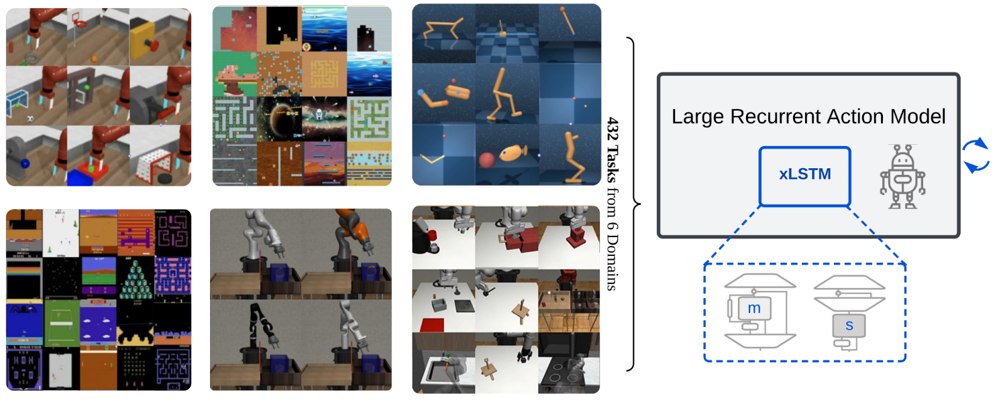

# A Large Recurrent Action Model: xLSTM enables Fast Inference for Robotics Tasks
[](https://arxiv.org/abs/TODO)
[](https://opensource.org/licenses/MIT)

Thomas Schmied<sup>**1**</sup>, Thomas Adler<sup>**1**</sup>, Vihang Patil<sup>**1**</sup>, Maximilian Beck<sup>**1**, **2**</sup>, Korbinian Pöppel<sup>**1**, **2**</sup>, Johannes Brandstetter<sup>**1**, **2**</sup>, Günter Klambauer<sup>**1,2**</sup>, Razvan Pascanu<sup>**3,4**</sup>, Sepp Hochreiter<sup>**1,2**</sup> 

<sup>**1**</sup>ELLIS Unit Linz and LIT AI Lab, Institute for Machine Learning, JKU Linz, Austria\
<sup>**2**</sup>NXAI, <sup>**3**</sup>Google DeepMind, <sup>**4**</sup>UCL

This repository contains the source code for **" A Large Recurrent Action Model: xLSTM enables Fast Inference for Robotics Tasks"**.
The paper is available on [ArXiv](TODO). 

 

## Overview
This code-based is built on [L2M](https://github.com/ml-jku/L2M) and [RA-DT](https://github.com/ml-jku/RA-DT) and relies on open-source frameworks, including: 
- [PyTorch](https://github.com/pytorch/pytorch)
- [Huggingface transformers](https://github.com/huggingface/transformers)
- [stable-baselines3](https://github.com/DLR-RM/stable-baselines3)
- [wandb](https://github.com/wandb/wandb)
- [Hydra](https://github.com/facebookresearch/hydra)


What is in this repository? 
```
.
├── configs                    # Contains all .yaml config files for Hydra to configure agents, envs, etc.
│   ├── agent_params            
│   ├── wandb_callback_params
│   ├── env_params
│   ├── eval_params
│   ├── run_params
│   └── config.yaml            # Main config file for Hydra - specifies log/data/model directories.
├── continual_world            # Submodule for Continual-World.
├── dmc2gym_custom             # Custom wrapper for DMControl.
├── figures             
├── src                        # Main source directory.
│   ├── algos                  # Contains agent/model/prompt classes.
│   ├── augmentations          # Image augmentations.
│   ├── buffers                # Contains replay trajectory buffers.
│   ├── callbacks              # Contains callbacks for training (e.g., WandB, evaluation, etc.).
│   ├── data                   # Contains data utilities.
│   ├── envs                   # Contains functionality for creating environments.
│   ├── optimizers             # Contains optimizers.
│   ├── schedulers             # Contains learning rate schedulers.
│   ├── tokenizers_custom      # Contains custom tokenizers for discretizing states/actions.
│   ├── utils                  
│   └── __init__.py
├── LICENSE
├── README.md
├── environment.yaml
├── requirements.txt
├── evaluate.py                # Entry point for evaluating agents.
└── main.py                    # Entry point for training agents.
```
## Installation
Environment configuration and dependencies are available in `environment.yaml` and `requirements.txt`.

Create the conda environment:
```
conda env create -f environment.yaml
conda activate lram
```

Install the remaining requirements (with MuJoCo already downloaded, if not see [here](#MuJoCo-installation)): 
```
pip install -r requirements.txt
```

Init the `continualworld` submodule, install `metaworld`: 
```
git submodule init
git submodule update
cd continual_world
pip install .
pip install git+https://github.com/rlworkgroup/metaworld.git@18118a28c06893da0f363786696cc792457b062b
```

Install custom version of [dmc2gym](https://github.com/denisyarats/dmc2gym):
```
cd dmc2gym_custom
pip install -e .
```

To install `composuite` we refer to [src/data/composuite/README.md](src/data/composuite/README.md).

To install `mimicgen` we refer to [src/data/mimicgen/README.md](src/data/mimicgen/README.md).

For ICL experiments on Dark-Room `minihack` is required. We refer to [RA-DT](https://github.com/ml-jku/RA-DT?tab=readme-ov-file#installation) for instructions.

### xLSTM & Mamba dependencies
We rely on the official implementations of [xLSTM](https://github.com/NX-AI/xlstm) and [Mamba](https://github.com/state-spaces/mamba) and maintain separate conda environments to avoid dependency conflicts.

Install xLSTM using: 
```
pip install xlstm 
```

Install Mamba using: 
```
pip install mamba_ssm==2.1.0
pip install causal-conv1d==1.3.0.post1
```
### MuJoCo installation
For the installation of MuJoCo and tips on troubleshooting, we refer to the L2M repository: https://github.com/ml-jku/L2M

## Setup

### Experiment configuration
This codebase relies on [Hydra](https://github.com/facebookresearch/hydra), which configures experiments via `.yaml` files. 
Hydra automatically creates the log folder structure for a given run, as specified in the respective `config.yaml` file.

The `config.yaml` is the main configuration entry point and contains the default parameters. The file references the respective default parameter files under the block
`defaults`. In addition, `config.yaml` contains 4 constants that configure the directory paths: 
```
LOG_DIR: ./logs
DATA_DIR: ./data
SSD_DATA_DIR: ./data
MODELS_DIR: ./models
```

### Datasets
For our experiments we use the datasets for the following environments: 
- Atari --> see [src/data/atari/README.md](src/data/atari/README.md)
- Composuite --> see [src/data/composuite/README.md](src/data/composuite/README.md)
- Mimicgen --> see [src/data/mimicgen/README.md](src/data/mimicgen/README.md)
- Procgen
- Meta-World
- DMControl

Our datasets for Meta-World and DMControl are available on [Huggingface Hub](https://huggingface.co/ml-jku) 🤗, and can be downloaded using the `huggingface-cli`: 
```
# dm_control 10M
huggingface-cli download ml-jku/dm_control_10M --local-dir=./dm_control_10M --repo-type dataset
# meta_world 2M
huggingface-cli download ml-jku/meta-world --local-dir=./meta-world --repo-type dataset
```
To extract the downloaded `.tar.gz` files, use [untar_files.sh](src/data/untar_files.sh):
```
bash untar_files.sh SRC DST
```

For the 20M Procgen datasets, we refer to [RA-DT](https://github.com/ml-jku/RA-DT?tab=readme-ov-file#datasets). 

### Multi-GPU training
For multi-GPU training, we use `torchrun`, as documented in [L2M](https://github.com/ml-jku/L2M/blob/main/README.md#multi-gpu-training).
A launcher plugin [hydra_torchrun_launcher](https://github.com/facebookresearch/hydra/tree/main/contrib/hydra_torchrun_launcher) exists for `hydra`.

To enable the plugin, clone the `hydra` repo, cd to `contrib/hydra_torchrun_launcher`, and pip install the plugin: 
```
git clone https://github.com/facebookresearch/hydra.git
cd hydra/contrib/hydra_torchrun_launcher
pip install -e .
```
The plugin can be used from the commandline: 
```
python main.py -m hydra/launcher=torchrun hydra.launcher.nproc_per_node=4 [...]
```
Running experiments on a local cluster on a single node can be done via `CUDA_VISIBLE_DEVICES` to specify the GPUs to use: 
```
CUDA_VISIBLE_DEVICES=0,1,2,3 python main.py -m hydra/launcher=torchrun hydra.launcher.nproc_per_node=4 [...]
```

On Slurm, executing `torchrun` on a single node works alike. E.g., to run on 4 GPUs on a single node: 
```
#!/bin/bash
#SBATCH --account=X
#SBATCH --qos=X
#SBATCH --partition=X
#SBATCH --nodes=1
#SBATCH --gpus=4
#SBATCH --cpus-per-task=32

source activate lram
python main.py -m hydra/launcher=torchrun hydra.launcher.nproc_per_node=4 [...]
```
For multi-node training we refer to the documentation in [L2M](https://github.com/ml-jku/L2M/blob/main/README.md#multi-node-training)

## Running experiments
In the following, we provide examples of how to run the experiments in the paper. We conducted all our experiments
on a server equipped with 4 A100s and use `DistributedDataParallel` functionalities provided by PyTorch.

To train 16M models, run: 
```
# xLSTM [1:0] 
python main.py -m +hydra/launcher=torchrun hydra.launcher.nproc_per_node=4 +ddp=True seed=44 experiment_name=16M_xlstm_m_v1 env_params=mt_dmc_procgen_atari_cs_mg agent_params=multi_domain agent_params.kind=MDDXLSTM run_params=pretrain eval_params=pretrain agent_params/huggingface=xlstm_medium agent_params.batch_size=32 +agent_params.accumulation_steps=6 +eval_params.use_valid_callback=True +wandb_callback_params=pretrain

# xLSTM [7:1]
python main.py -m +hydra/launcher=torchrun hydra.launcher.nproc_per_node=4 +ddp=True seed=44 experiment_name=16M_xlstm_ms_v1 env_params=mt_dmc_procgen_atari_cs_mg agent_params=multi_domain agent_params.kind=MDDXLSTM run_params=pretrain eval_params=pretrain agent_params/huggingface=xlstm_medium agent_params.batch_size=32 +agent_params.accumulation_steps=6 +agent_params.huggingface.xlstm_config.slstm_at='[1]' +eval_params.use_valid_callback=True +wandb_callback_params=pretrain

# DT
python main.py -m +hydra/launcher=torchrun hydra.launcher.nproc_per_node=4 +ddp=True seed=44 experiment_name=16M_dt_v1 env_params=mt_dmc_procgen_atari_cs_mg agent_params=multi_domain run_params=pretrain eval_params=pretrain agent_params/huggingface=dt_medium_64 +agent_params.model_kwargs.global_pos_embds=True agent_params.batch_size=32 +agent_params.accumulation_steps=6 +eval_params.use_valid_callback=True +wandb_callback_params=pretrain

# Mamba
python main.py -m +hydra/launcher=torchrun hydra.launcher.nproc_per_node=4 +ddp=True seed=44 experiment_name=16M_mamba_v1 env_params=mt_dmc_procgen_atari_cs_mg agent_params=multi_domain agent_params.kind=MDDMamba run_params=pretrain eval_params=pretrain agent_params/huggingface=mamba_medium agent_params.compile=False agent_params.batch_size=32 +agent_params.accumulation_steps=6 +eval_params.use_valid_callback=True +wandb_callback_params=pretrain
```

48M models: 
```
# xLSTM [1:0] 
python main.py -m +hydra/launcher=torchrun hydra.launcher.nproc_per_node=4 +ddp=True seed=44 experiment_name=48M_xlstm_m_v1 env_params=mt_dmc_procgen_atari_cs_mg agent_params=multi_domain agent_params.kind=MDDXLSTM run_params=pretrain eval_params=pretrain agent_params/huggingface=xlstm_mediumplus agent_params.batch_size=32 +agent_params.accumulation_steps=6 +eval_params.use_valid_callback=True +wandb_callback_params=pretrain

# xLSTM [7:1]
python main.py -m +hydra/launcher=torchrun hydra.launcher.nproc_per_node=4 +ddp=True seed=44 experiment_name=48M_xlstm_ms_v1 env_params=mt_dmc_procgen_atari_cs_mg agent_params=multi_domain agent_params.kind=MDDXLSTM run_params=pretrain eval_params=pretrain agent_params/huggingface=xlstm_mediumplus agent_params.batch_size=32 +agent_params.accumulation_steps=6 +agent_params.huggingface.xlstm_config.slstm_at='[1,3]' +eval_params.use_valid_callback=True +wandb_callback_params=pretrain

# DT
python main.py -m +hydra/launcher=torchrun hydra.launcher.nproc_per_node=4 +ddp=True seed=44 experiment_name=48M_dt_v1 env_params=mt_dmc_procgen_atari_cs_mg agent_params=multi_domain run_params=pretrain eval_params=pretrain agent_params/huggingface=dt_mediumplus_64 +agent_params.model_kwargs.global_pos_embds=True agent_params.batch_size=32 +agent_params.accumulation_steps=6 +eval_params.use_valid_callback=True +wandb_callback_params=pretrain

# Mamba
python main.py -m +hydra/launcher=torchrun hydra.launcher.nproc_per_node=4 +ddp=True seed=44 experiment_name=48M_mamba_v1 env_params=mt_dmc_procgen_atari_cs_mg agent_params=multi_domain agent_params.kind=MDDMamba run_params=pretrain eval_params=pretrain agent_params/huggingface=mamba_mediumplus agent_params.compile=False agent_params.batch_size=32 +agent_params.accumulation_steps=6 +eval_params.use_valid_callback=True +wandb_callback_params=pretrain
```

110M models: 
```
# xLSTM [1:0]
python main.py -m +hydra/launcher=torchrun hydra.launcher.nproc_per_node=4 +ddp=True seed=44 experiment_name=110M_xlstm_m_v1 env_params=mt_dmc_procgen_atari_cs_mg agent_params=multi_domain agent_params.kind=MDDXLSTM run_params=pretrain eval_params=pretrain agent_params/huggingface=xlstm_large agent_params.batch_size=32 +agent_params.accumulation_steps=6 +eval_params.use_valid_callback=True +wandb_callback_params=pretrain

# xLSTM [7:1]
python main.py -m +hydra/launcher=torchrun hydra.launcher.nproc_per_node=4 +ddp=True seed=44 experiment_name=110M_xlstm_ms_v1 env_params=mt_dmc_procgen_atari_cs_mg agent_params=multi_domain agent_params.kind=MDDXLSTM run_params=pretrain eval_params=pretrain agent_params/huggingface=xlstm_large agent_params.batch_size=32 +agent_params.accumulation_steps=6 +agent_params.huggingface.xlstm_config.slstm_at='[1,3]' +eval_params.use_valid_callback=True +wandb_callback_params=pretrain

# DT
python main.py -m +hydra/launcher=torchrun hydra.launcher.nproc_per_node=4 +ddp=True seed=44 experiment_name=110M_dt_v1 env_params=mt_dmc_procgen_atari_cs_mg agent_params=multi_domain run_params=pretrain eval_params=pretrain agent_params/huggingface=dt_largeplus_64 +agent_params.model_kwargs.global_pos_embds=True agent_params.batch_size=32 +agent_params.accumulation_steps=6 +eval_params.use_valid_callback=True +wandb_callback_params=pretrain

# Mamba
python main.py -m +hydra/launcher=torchrun hydra.launcher.nproc_per_node=4 +ddp=True seed=44 experiment_name=110M_mamba_v1 env_params=mt_dmc_procgen_atari_cs_mg agent_params=multi_domain agent_params.kind=MDDMamba run_params=pretrain eval_params=pretrain agent_params/huggingface=mamba_large agent_params.compile=False agent_params.batch_size=32 +agent_params.accumulation_steps=6 +eval_params.use_valid_callback=True +wandb_callback_params=pretrain
```

208M models: 
```
# xLSTM [1:0]
python main.py -m +hydra/launcher=torchrun hydra.launcher.nproc_per_node=4 +ddp=True seed=44 experiment_name=206M_xlstm_m_v1 env_params=mt_dmc_procgen_atari_cs_mg agent_params=multi_domain agent_params.kind=MDDXLSTM run_params=pretrain eval_params=pretrain agent_params/huggingface=xlstm_huge agent_params.batch_size=32 +agent_params.accumulation_steps=6 +eval_params.use_valid_callback=True +wandb_callback_params=pretrain

# xLSTM [7:1]
python main.py -m +hydra/launcher=torchrun hydra.launcher.nproc_per_node=4 +ddp=True seed=44 experiment_name=206M_xlstm_ms_v1 env_params=mt_dmc_procgen_atari_cs_mg agent_params=multi_domain agent_params.kind=MDDXLSTM run_params=pretrain eval_params=pretrain agent_params/huggingface=xlstm_huge agent_params.batch_size=32 +agent_params.accumulation_steps=6 +agent_params.huggingface.xlstm_config.slstm_at='[1,3,5]' +eval_params.use_valid_callback=True +wandb_callback_params=pretrain

# DT
python main.py -m +hydra/launcher=torchrun hydra.launcher.nproc_per_node=4 +ddp=True seed=44 experiment_name=206M_dt_v1 env_params=mt_dmc_procgen_atari_cs_mg agent_params=multi_domain run_params=pretrain eval_params=pretrain agent_params/huggingface=dt_huge +agent_params.model_kwargs.global_pos_embds=True agent_params.batch_size=32 +agent_params.accumulation_steps=6 +eval_params.use_valid_callback=True +wandb_callback_params=pretrain

# Mamba
python main.py -m +hydra/launcher=torchrun hydra.launcher.nproc_per_node=4 +ddp=True seed=44 experiment_name=206M_mamba_v1 env_params=mt_dmc_procgen_atari_cs_mg agent_params=multi_domain agent_params.kind=MDDMamba run_params=pretrain eval_params=pretrain agent_params/huggingface=mamba_huge agent_params.compile=False agent_params.batch_size=32 +agent_params.accumulation_steps=6 +eval_params.use_valid_callback=True +wandb_callback_params=pretrain
```

## Citation
If you find this useful, please consider citing our work: 
```
@article{schmied2024,
  title={A Large Recurrent Action Model: xLSTM enables Fast Inference for Robotics Tasks},
  author={Schmied, Thomas and Adler, Thomas and Patil, Vihang and Beck, Maximilian and Pöppel, Korbinian and Brandstetter, Johannes and Klambauer, Günter and Pascanu, Razvan and Hochreiter, Sepp},
  journal={ArXiv},
  year={2024},
  url={https://arxiv.org/abs/TODO}
}
```
